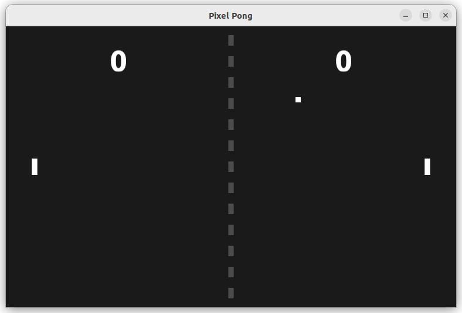

# Pixel Pong

A classic Pong game implementation using the Bevy game engine (version 0.15.3).



## Description

Pixel Pong is a modern recreation of the classic arcade game Pong. It features two paddles controlled by players, a bouncing ball that increases in speed as the game progresses, and a scoreboard to keep track of points.

## Features

- Classic Pong gameplay
- Score tracking
- Controls using W/S keys for the left paddle and Up/Down for the right paddle

## Controls

- **Left Paddle**: W (up) and S (down)
- **Right Paddle**: Up Arrow (up) and Down Arrow (down)
- **Quit Game**: Escape key

## Building and Running

### Prerequisites

- Rust and Cargo

### Run the Game

```bash
cargo run --release
```

## License

MIT

## Credits

Created with [Bevy](https://bevyengine.org/) - A refreshingly simple data-driven game engine built in Rust. 